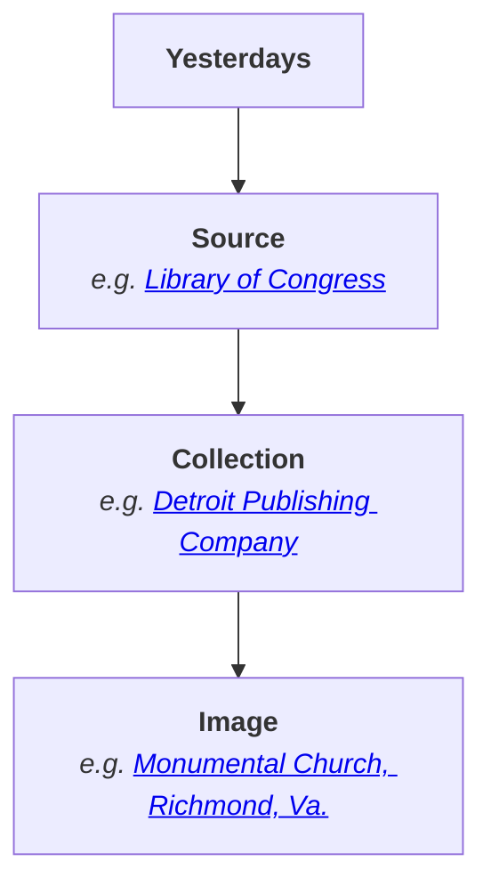

# Organization System

Content in Yesterdays is organized in a three-level hierarchy of _sources_, _collections_, and _images_:

## Sources

Sources represent individual institutions, e.g. Library of Congress, where we have sourced images on Yesterdays.
The images in Yesterdays are from online databases provided by these institutions, or in some cases provided directly from those insitutions.
You can browse the sources on Yesterdays [here](https://yesterdays.today/browse/).

## Collections

Collections are sequences of images.
They cannot be nested.
Each _collection detail page_ includes a description of that collection as well as a link to that collection's original webpage, if available.

In general we do our best to import collections exactly as they are presented by the source.
In some cases where 

## Images

Images are at the heart of Yesterdays.
Each image has its own unique ID, and is permanently accessible at `https://yesterdays.today/<ID>`.
This is called the _image detail page_, and includes the following information:

- a zoom-able view of the image
- metadata about that image from the source
- the current point and/or polygonal georeference, displayed on a map
- comments and georeferencing notes from Yesterdays users
- a list of subjects the image depicts

<figure class="ui-demo-figure ui-demo-figure--card">
  <iframe
    class="ui-demo-frame"
    src="demos/image-card.html"
    aria-label="Example Yesterdays image card for Monumental Church"
    loading="lazy"></iframe>
  <figcaption>
      An example image card.
  </figcaption>
</figure>

While most images in Yesterdays are old photographs, they also include:

- [drawings](https://yesterdays.today/10875/)
- [postcards](https://yesterdays.today/17088/)
- [architectural sketches](https://yesterdays.today/14250/)

These can often be georeferenced, too, _even if they do not represent reality._
For example, we can place an architectural sketch on the map even if the building was never built.

### Availability

_Availability_ refers to whether or not an image is eligible to be georeferenced. In some cases, images are tagged as _Will Not Georeference_, meaning that they cannot reasonably be placed on the map.
These are presented with the **:fontawesome-solid-ban: Skip**{ .badge .badge--skip } badge in Yesterdays.

Once an image has been georeferenced logged-in users may submit _corrections_, or subsequent georeferences, which take precedence over prior georeferences.
In this way, the Yesterdays community can iteratively refine our georeferences.

### Difficulty

Yesterdays administrators label images as **Easy**{ .badge .badge--easy }, **Medium**{ .badge .badge--medium }, or **Difficult**{ .badge .badge--difficult } to indicate to other users what the difficulty of georeferencing will likely be.
These are loose categorizations to help users estimate the time it would take to research an image and determine where it was taken.

### Metadata

On the image detail page, the "Image Details" infobox presents what we know about an image from the source.
This usually includes a date the image was created, and a description of the image.

When images are imported, miscellaenous metadata fields may be added to the description to lend context.
In the following example, multiple fields from Library of Congress were combined into the description field in Yesterdays.

<figure class="ui-demo-figure ui-demo-figure--details">
  <iframe
    class="ui-demo-frame ui-demo-frame--details"
    src="demos/image-details.html"
    aria-label="Example Yesterdays Image Details panel for Monumental Church"
    loading="lazy"></iframe>
</figure>

### Rating

The rating in the "Image Details" infobox is an averaged rating from Yesterdays users.
If you are logged in, clicking on the stars will reveal an interface for submitting your own rating for this image.
